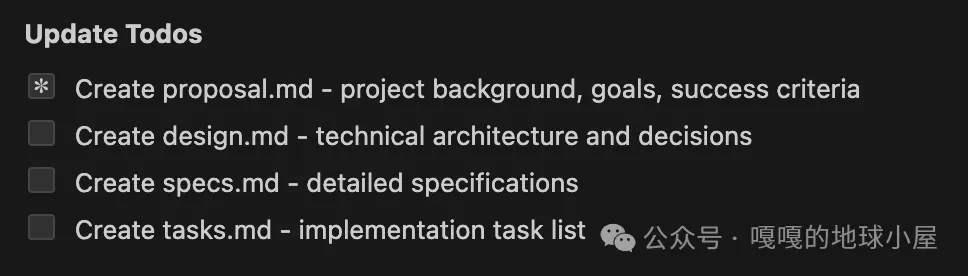
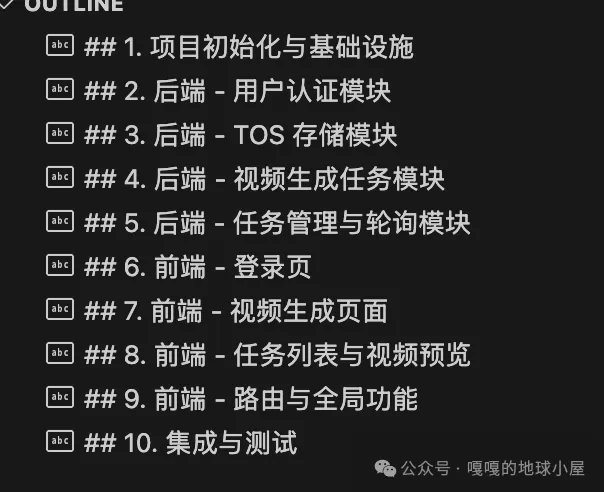
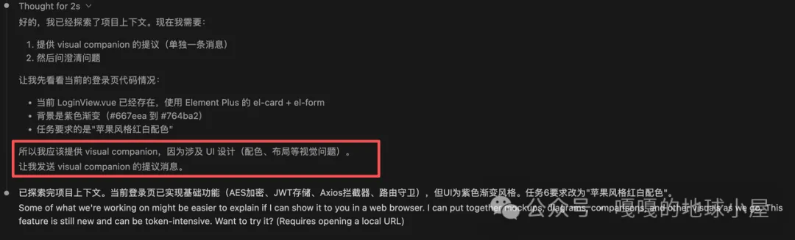
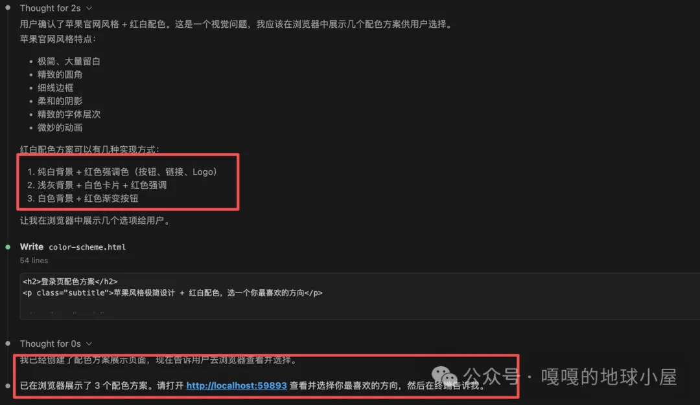
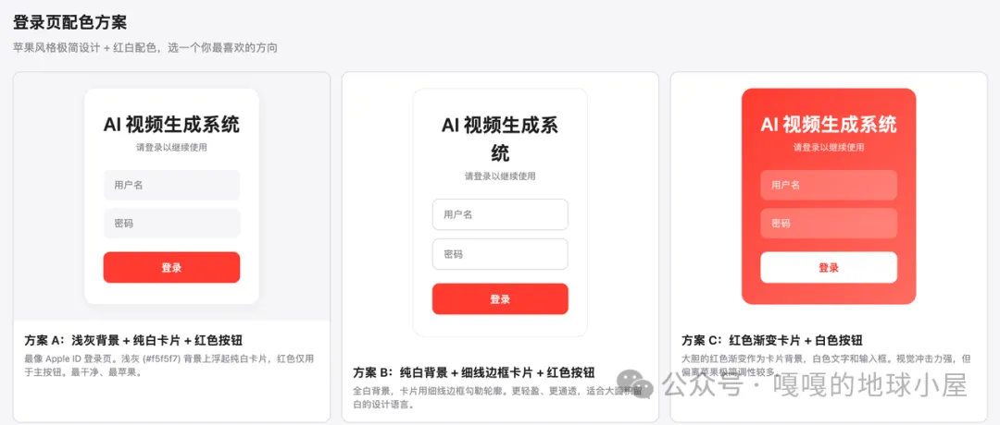
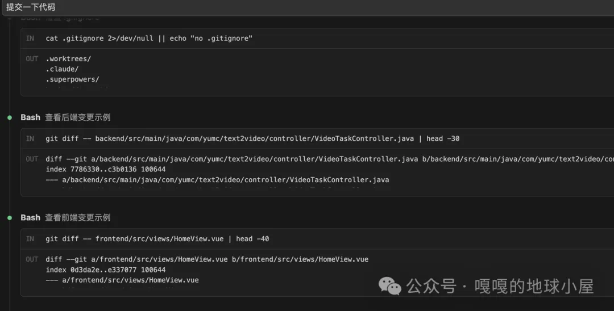
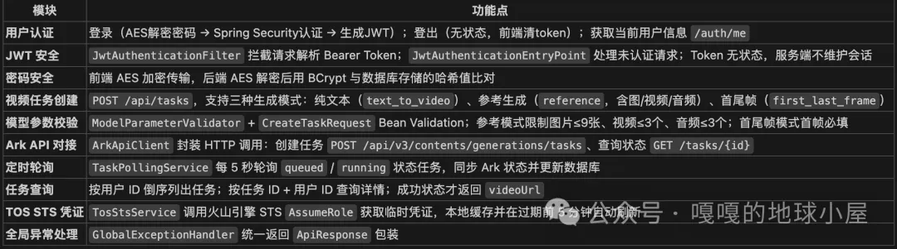
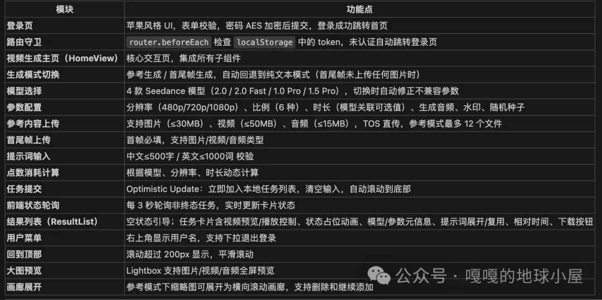
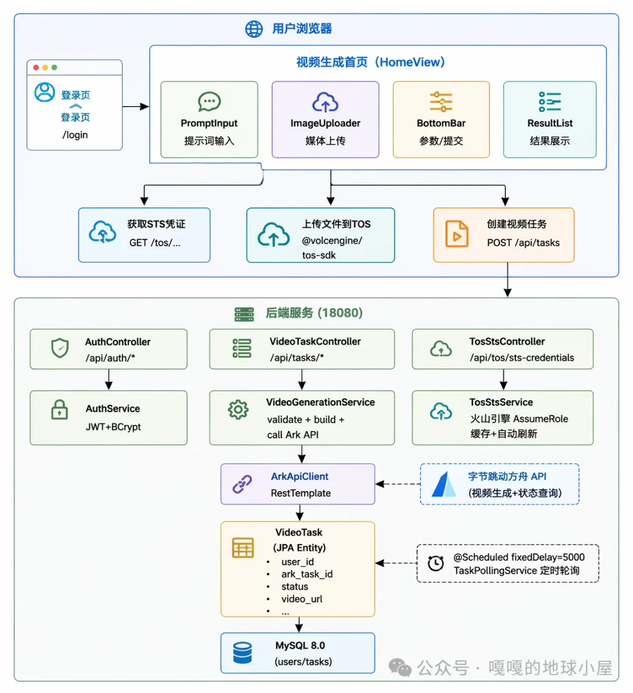

最近做了笨小葱做了一些实验，主要是希望找到可行的方法论，能够利用AI开发出达到生产要求的项目，并且评估相应的开发效率。
实际使用发现，通过匹配的skill组合、严格的开发规范及 Harness Engineering 方法，能够推动 AI 产出持续向项目需求收敛。
一、为什么需要一套组合拳？
用 AI 写代码的人越来越多，但真把它放进生产级项目里，三个老问题反复出现：

需求理解偏差。你让 AI 加个功能，它写出来后发现跟你想的不是一回事，返工。

执行过程黑盒。AI 写了什么、怎么写的、测了没有，你很难把控。

没有真实环境验证。代码看起来对了，但页面渲染、接口连通、部署后表现，AI 自己验证不了。

OpenSpec、Superpowers、gstack 分别解决这三个问题，组合起来就是一套完整的 AI 增强开发工作流。

工具	定位	解决什么问题
OpenSpec	规范驱动开发（需求层）	让 AI 和人在文字层面先达成共识，减少返工
Superpowers	AI 编码代理方法论（执行层）	把 AI 写代码的过程标准化、可观测、可审查
gstack	执行工具封装（验证层）	浏览器、QA、发布、监控，一键调用
一句话：OpenSpec 管需求，Superpowers 管写代码，gstack 管验证和交付。


二、三个组件分别做什么
2.1 OpenSpec：把需求写成机器可理解的规范
OpenSpec 的核心是双文件夹模型：

openspec/
specs/     # 当前系统的事实来源（规范文件）
changes/   # 每次变更的完整提案
每份变更包含三个文件：

proposal.md —— 为什么要做（背景、目标、成功标准）

design.md —— 技术方案（架构决策、接口设计、数据流）

tasks.md —— 实施清单（可执行的具体任务）

这三个文件本身就是 AI 和人之间的"契约"。AI 在动手写代码之前，先在这三份文档里和你对齐。据实测对比，使用 OpenSpec 后相同需求下的 Token 消耗降低 30%-50%，返工率下降 60% 以上。

2.2 Superpowers：强制流程约束 AI 的执行过程
Superpowers 不只是一个插件，而是一套不可跳过的 7 步工作流：

步骤	做什么	为什么重要
1. brainstorming	苏格拉底式提问，澄清任务细节	在写代码前暴露隐藏假设
2. git worktree	创建隔离分支，保护主分支	避免污染主干
3. writing-plans	拆解为 2-5 分钟可执行小任务	把大需求拆到 AI 能稳定完成的粒度
4. subagent 执行	每个任务派独立子代理	隔离上下文，减少干扰
5. TDD 循环	RED → GREEN → REFACTOR	每段代码都有测试覆盖
6. 代码审查	两阶段：规范合规 + 代码质量	人在关键环节把关
7. 分支收尾	验证测试、合并决策	干净收尾，不留债务
   关键是每一步都不可跳过。这不是官僚主义，而是生产环境的底线。

2.3 gstack：把开发者每天用的工具封装成一键命令
gstack 不做决策，只帮你干活：

/browse —— 浏览器截图、元素检查、用户流验证

/qa —— 端到端 QA 测试

/ship —— 发版流程（检测 base、跑测试、review diff、写 CHANGELOG）

/land-and-deploy —— 合并 PR、等 CI、验证生产环境

/canary —— 上线后监控错误和性能回归

/careful —— 危险命令拦截（rm -rf、DROP TABLE、force-push 等）

没有 gstack，Superpowers 写完了代码没法验证"页面渲染对不对"。这是绝大多数"我以为修好了"的根源。

图片
三、三者如何配合：数据流与分工边界
需求输入
│
▼
┌──────────────┐     proposal.md
│   OpenSpec   │ ──→ design.md
│  (需求对齐)   │     tasks.md
└──────────────┘
│
▼ tasks.md
┌──────────────┐     brainstorming → worktree → 小任务
│  Superpowers │ ──→ subagent 执行 → TDD → 代码审查
│  (规范执行)   │     分支收尾
└──────────────┘
│
▼ 代码产出
┌──────────────┐     /browse 截图验证
│    gstack    │ ──→ /qa 端到端测试
│  (验证交付)   │     /ship + /land-and-deploy + /canary
└──────────────┘
│
▼
生产上线
分工边界：

OpenSpec 只产出规范文档，不写代码。

Superpowers 只按规范执行编码流程，不直接操作浏览器或部署。

gstack 只做验证和交付动作，不参与需求分析或架构决策。

三者之间通过文件和命令传递信息，不是通过共享内存或隐式状态。

四、完整工作流：从需求到上线
阶段 1：需求对齐（OpenSpec）
在 openspec/changes/ 下新建变更目录

写 proposal.md：为什么要做、不做会怎样、成功标准是什么

写 design.md：技术方案、接口契约、数据模型

写 tasks.md：拆成具体可执行的任务列表

阶段 2：编码执行（Superpowers）
以 tasks.md 为输入，启动 brainstorming

AI 用苏格拉底式提问澄清模糊点（你确认要改这个接口吗？影响范围想清楚了吗？）

创建 git worktree 隔离分支

拆解为 2-5 分钟粒度的小任务

子代理并行/串行执行（按依赖关系判断）

每个任务走 TDD：先写测试，再写实现，最后重构

两阶段代码审查：先过规范合规检查，再过代码质量审查

阶段 3：验证交付（gstack）
/browse —— 打开页面，截图验证渲染效果

/qa —— 跑端到端测试，确认核心链路正常

/ship —— 发版：合并 base、跑测试、review diff、写 CHANGELOG

/land-and-deploy —— 合并 PR、等 CI、验证生产

/canary —— 监控上线后的错误率和性能指标

关键原则：没有测试/截图/QA 报告，不算完成。

五、安装与初始化

5.1 OpenSpec

npm install -g @fission-ai/openspec@latest
openspec init
在项目根目录执行 `openspec init` 后，
会自动创建 `openspec/specs/` 和 `openspec/changes/` 目录结构。
5.2 gstack
gstack 不在插件市场，直接从仓库安装：

git clone --single-branch --depth 1 \
https://github.com/garrytan/gstack.git \
~/.claude/skills/gstack

cd ~/.claude/skills/gstack && ./setup

setup 脚本会把 28 个 skill 符号链接到 `~/.claude/skills/` 顶层。
之后你在对话里用 `/browse`、`/qa`、`/ship` 就能触发。

setup 依赖 bun，没装的话先装：
curl -fsSL https://bun.sh/install | bash

**注意**：
macOS 上 bun 编译的单文件二进制可能因代码签名问题被系统 kill。
如果遇到这种情况，将 `browse/dist/browse` 替换为 wrapper 脚本，
改为通过 `bun run browse/src/cli.ts` 执行即可。
5.3 Superpowers
Superpowers 在 Claude Code / VS Code 插件市场里直接搜索安装即可。
六、配置要点：CLAUDE.md 的核心规则
要让这套工作流真正跑起来，需要在 ~/.claude/CLAUDE.md 中写明裁决规则，告诉 Claude 遇到什么情况该走哪个 skill。

# Claude Code 配置：OpenSpec + superpowers + gstack
主干由三个插件组成：
- OpenSpec —— 规范与需求层（proposal / design / tasks）
- superpowers —— 思考与流程层（plan / brainstorm / debug / TDD / review / verify）
- gstack —— 执行与外部世界层（browser / QA / ship / deploy / canary / 护栏）
  类比：OpenSpec 是蓝图，superpowers 是大脑，gstack 是手脚。
## 核心原则
1. **规范先行**：任何需求变更必须先过 OpenSpec，调用/opsx:propose，产出 proposal.md + design.md + tasks.md，再动手写代码。
2. 流程归 superpowers：brainstorm、plan、debug、TDD、verify、code review
   默认走 superpowers，不走 OMC / feature-dev 等同名第三方 skill。
3. 执行归 gstack：浏览器、QA、ship、deploy、canary、retro 走 gstack。
4. 独立 reviewer 通道：verification 和 code-review 分两个 pass，
   不能在同一上下文里合并。
5. 证据优先：没有测试/截图/QA 报告不算完成。
6. 歧义先 brainstorm：任何创造性工作前先调用 brainstorming。
7. 最短路径优先：能用一个 skill 解决的，不升级为完整闭环。
## OpenSpec 规范工作流
### 双文件夹模型
```
openspec/
  specs/     # 当前系统的事实来源（规范文件）
  changes/   # 每次变更的完整提案
```
### 每份变更必须包含三个文件
- `proposal.md` —— 为什么要做（背景、目标、成功标准、不做会怎样）
- `design.md` —— 技术方案（架构决策、接口设计、数据流、依赖关系）
- `tasks.md` —— 实施清单（可执行的具体任务，作为 Superpowers 的输入）
### 职责边界
- OpenSpec **只产出规范文档，不写代码**。
- Superpowers **只按 tasks.md 执行编码流程**，不修改 OpenSpec 规范。
- gstack **只做验证和交付动作**，不参与需求分析或架构决策。
- 三者之间通过**文件和命令**传递信息，不通过共享内存或隐式状态。
### 规范与执行的衔接
1. 需求输入 → OpenSpec 输出 `tasks.md`
2. `tasks.md` 作为 Superpowers 的输入启动 brainstorming
3. 编码执行过程中如发现规范遗漏或错误，**回退到 OpenSpec 更新 design.md / tasks.md**，再继续执行
## 任务分流
### 只读任务
分析、解释、架构说明、代码阅读 —— 直接处理。
真实 bug 排查但尚未修改 —— 用 systematic-debugging。
### 轻量任务
单文件或小范围修改、明确 bug 修复、配置/文案调整、小测试补充。
跳过完整 brainstorming / writing-plans / worktrees / 重 review 链。
直接实现 + 定向验证 + 必要时 /browse 看效果。
### 中任务
多文件但边界清晰，新功能或明确的重构。
OpenSpec  /opsx:propose（必须首先调用）→ 简短 brainstorming + 短 writing-plans + 实现 + /browse 或 /qa + verification。
### 大任务
跨模块、共享逻辑、新架构、公共 API 变更。
完整闭环：OpenSpec  /opsx:propose（必须首先调用）→ brainstorming → writing-plans → /plan-*-review
→ executing-plans + worktrees + TDD → /qa → verification
→ code-review → finishing-branch → /ship → /land-and-deploy → /canary
## 浏览器规则
/browse 是唯一的浏览器入口。禁止使用 mcp__claude-in-chrome__*
和 mcp__computer-use__* 来操作浏览器。
## Subagent 策略
一定派子代理：
- 用户明说 "并行 / parallel / dispatch"
- 2-4 个边界清晰、独立验证、无共享状态的子任务
- 纯只读的多目标研究
  一定不派：
- 任务有顺序依赖
- 多个子任务改同一文件 / contract / shared types
- package.json / lockfile / 根配置 / CI / schema / 总入口 默认串行
- 单一目标的 bug 修复
- 根因未明的调试
## 安全护栏
- rm -rf / DROP TABLE / force-push / git reset --hard / kubectl delete
  必须先过 /careful 或 /guard
- 调试敏感模块时用 /freeze  限定可改范围
- /ship 和 /land-and-deploy 必须用户明确确认
- 密钥/凭证/API Key 不得硬编码
- 数据库访问用参数化查询
- 不用不可信输入拼接 shell 命令或 SQL
## Change Delivery Gate
声明完成、准备 commit / push / PR 之前必须满足：
1. 已完成相关验证，并如实报告结果
2. 已过对应质量门禁（review / verification）
3. 关键验证无法执行时必须明确说明原因
4. 禁止虚构命令输出
5. 没有验证证据，不得声称"通过" / "完成"
## 不要重复造轮子
- 需求分析先用/opsx:propose、proposal / design / tasks 文档编写
- 规范评审、技术方案确认
- tasks.md 作为 Superpowers 的唯一输入
  只走 superpowers：
- plan / brainstorming / writing-plans / executing-plans
- TDD / debugging / verification
- code review / subagent / worktrees / 分支收尾
  只走 gstack：
- 浏览器、QA、ship、deploy、canary、retro、document-release
- 多视角 plan review (CEO / Eng / Design)
- 危险命令护栏 / freeze 沙箱
- 安全审计 / design-consultation / investigate
  七、实战案例
  下面以一个小项目从0到1实战一下。
  第一步确定需求，安装完openspec之后，初始化一下。
  openspec init
  在项目根目录执行 `openspec init` 后，
  会自动创建 `openspec/specs/` 和 `openspec/changes/` 目录结构。
  如果有明确的需求，
  那就直接使用openSec生成需求文档。

(如果没有明确的需求，那可以先使用/brainstorming 一步步确定需求范围，然后将生成的方案文档作为输入给到openSec)

> 现在需要开发一个类似“即梦”一样的AI视频生成系统，具体明确的需求参考文档xxxx。

AI会根据CLAUDE.md文件中的规则配置，先执行/opsx:propose
图片
然后会创建一系列文件：


花费一些时间，查看和修改文档。其中tasks.md中是一个个明确的任务。


接下来选择某一个具体的任务作为输入，让superpowers干活。
> /brainstorming 完成 任务6: 前端 - 登录页

这里有一个visual companion功能，在前端设计的时候非常有用，可以针对不同方案，直接画出示意图。非常直观清晰！


确定了方案之后，superpower会执行接下来的brainstorming → writing-plans → executing-plans + worktrees + TDD整套流程。
在完成开发和集成测试之后，可以进一步使用gstack的 /brower skill 来访问浏览器截图验证功能。
最后提交代码


最后出来的页面效果和系统功能全都达到生产水准。还是很nice的。


经验小总结：
1.每一个任务开发测试完成之后都可以commit一下代码。一个个小任务逐步迭代，逐步验证，会比所有的任务全部开发完，再测试验证提交，要整体可控很多。
2.在完成第一任务：构建项目基础框架之后，就可以先将项目结构、环境说明、启动参数、编码规范等内容写入到CLAUDE.md中，这样后续任务重启会话之后就不用每次都检查所有文件，重新熟悉项目了，可以节省时间和Token。
3.前端效果如果发现一般，可以使用/frontend-design skill来做前端开发，告诉它：css样式参考苹果官网，红白配色。然后给出一些满意的网站布局示意图，让ai照着做。有很多动效AI也是一次就能生成好，不会前端的小白会很喜欢。
4.开发代码的时候，可以安装 context7 这个skill，可以自动查找到最新版本的代码使用，避免AI生成的代码和依赖版本对不上。
5.整个过程中，我经常会看AI的Thinking内容，看看它到底是怎么思考的。如果发现一些无意义的，重复的，错误的步骤就会考虑是否应该把这些步骤通过一些规则说明来后续规避掉，这样可以不断的提升AI的效率。
这里也会更加深刻的体会到Harness Engineering 的原始定义：”每次 Agent 犯错时，你花时间设计一个解决方案，确保 Agent 永远不会再犯同样的错误。”
整个系统一共耗时5天左右，干中学。最后实现的功能如下：
后端（Spring Boot），2k行代码

前端（Vue 3 + Element Plus），4k行代码

整体架构图
